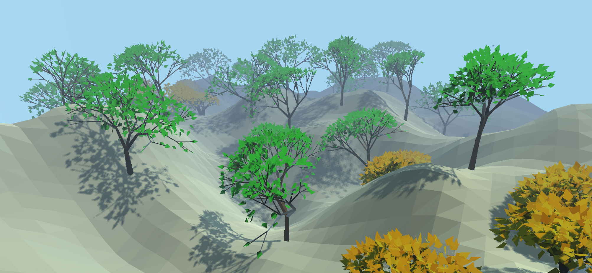

# godot-vegetator
Rapidly generate and place trees, bushes, grass, and more in Godot

## Overview
This is a proof-of-concept for quickly generating and placing and infinite number of [L-system](https://en.wikipedia.org/wiki/L-system) style plants within a Godot scene. All relevant code is contained within the "Vegetator" folder and can be easily imported to your project. The code is straightforward and can be expanded for your use-case. 

This solution focuses on maintaining high performance while making each plant unique. It achieves this by using the GPU to repeatedly transform a single, simple mesh repeatedly via MultiMeshInstance. This allows each plant to be unique while keeping the number of draw calls to a minimum.

This can be used out-of-box for quickly adding vegetation to prototype levels, or potentially a final solution for low-poly projects. This is not a good solution for near-camera plants due to the intersections between branches. For this use case, [generating plant meshes as a single array mesh](https://github.com/adszads/godot-procedural-tree-generation) at the cost of increased draw calls would be a better approach.

## Features
### PlacementManager.gd
Manages the placement of all plants within your scene on regular or irregular target surfaces. This allows you to overlap multiple plant types and have them placed next to each other intelligently without intersecting. (e.g. grass under bushes, and bushes between trees)

### LeafMultiMeshInstance.gd
Manages the placement of all leaves on plants associated to this node. This allows you to manage and edit the leaves across multiple plants at once. Additional leaves can also be "interpolated" between each plant's branches, allowing for dense foliage while maintaining simple branch structures. Supported by LeafMultiMesh.gd.

### BranchMultiMeshInstance.gd
Generates the location, rotation, and size of each branch in the user-defined L-system. Tests and records the placement of each plant with PlacementManager.gd. Records and requests leaf placement with LeafMultiMeshInstance.gd. Supported by BranchMultiMesh.gd. 

## How to Use
>See the demo scene for more details

* Import the Vegetator into your project
* Set up a minimum of three nodes in your project and attach the . This hierarchy is recommended but not required:
    - Placement Manager Node (Node) (PlacementManager.gd)
        - Leaf Manager Node (MultiMeshInstance) (LeafMultiMeshInstance.gd)
            - Plant Instancer Node (MultiMeshInstance) (BranchMultiMeshInstance.gd)
* Link the nodes together and set the desired parameters using the script variables panel
* Click "reinstance" in the script variables panel to preview the plants in your Godot editor
